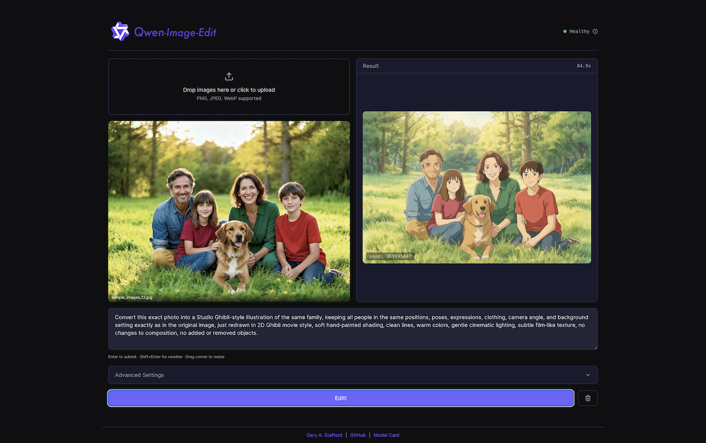
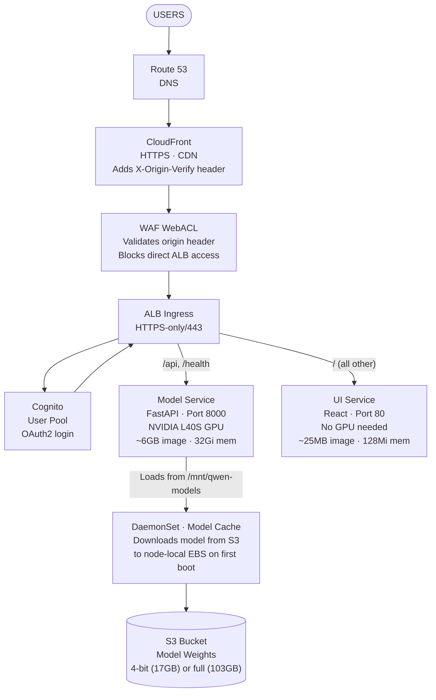
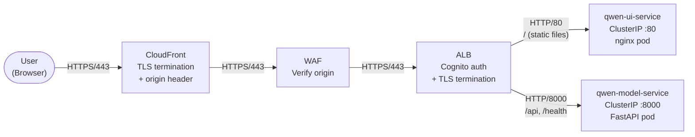
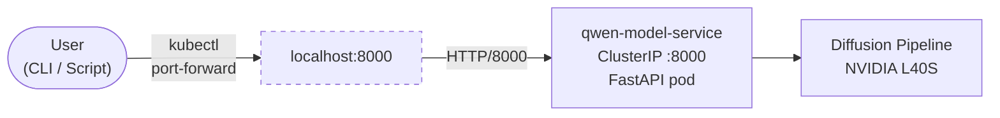
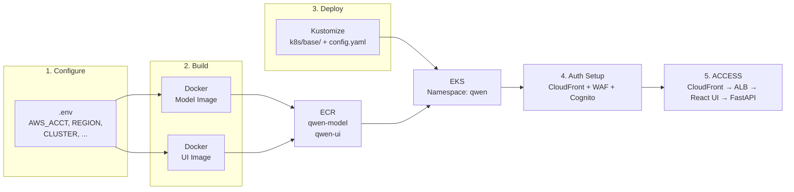
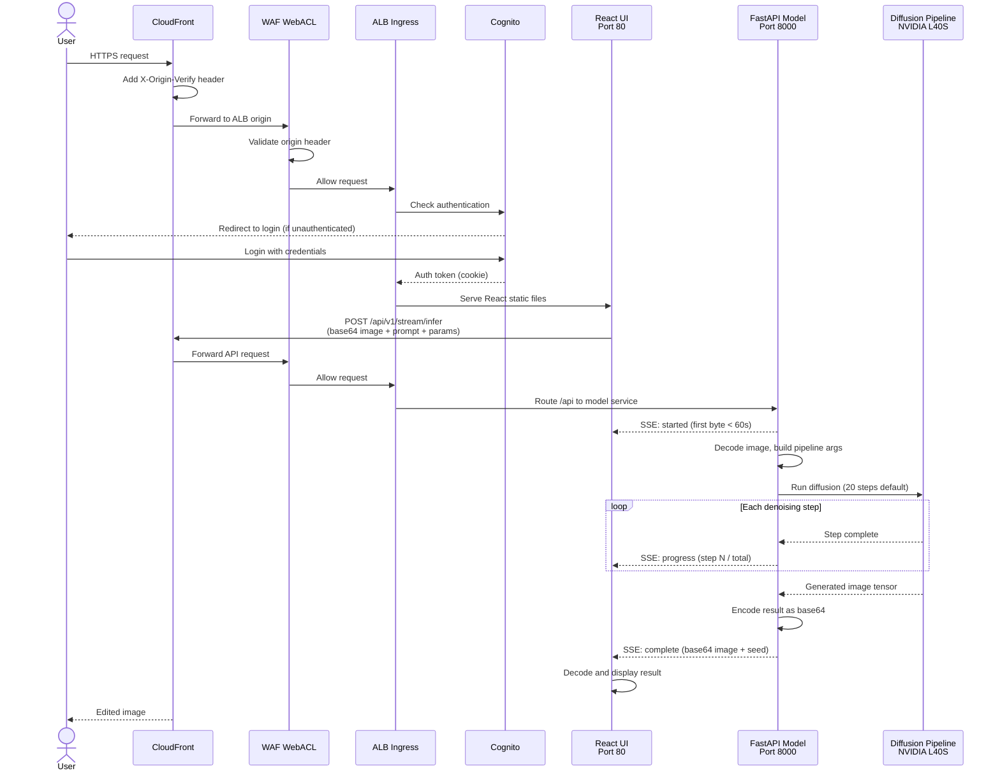
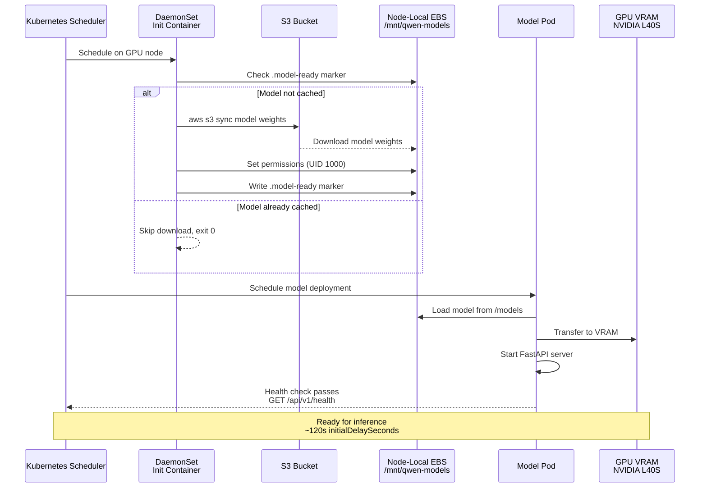

# Qwen Image Edit 2511 Deployment to Amazon EKS

AI-powered image editing using the Qwen Vision Language Model, deployed on Amazon EKS with GPU acceleration. See the blog post, [Deploying Qwen Image Edit Model to Amazon EKS with GPU Acceleration](https://garystafford.medium.com/deploying-qwen-image-edit-model-to-amazon-eks-with-gpu-acceleration-d71c7f4fca61) for complete details.



## Architecture



### Two-Container Design

| Container           | Image Size | GPU                     | Purpose              |
| ------------------- | ---------- | ----------------------- | -------------------- |
| **Model** (FastAPI) | ~6GB       | NVIDIA L40S (48GB VRAM) | Inference engine     |
| **UI** (React)      | ~25MB      | None                    | Interactive frontend |

Separating UI from model allows fast UI iteration
without rebuilding the heavy model container. The model deployment uses a
`Recreate` strategy since only one GPU pod can run at a time.

### TLS and Traffic Flow

TLS terminates at CloudFront (viewer-facing) and again at the ALB (origin-facing). Internal cluster traffic uses plain HTTP. WAF validates the origin verify header before the ALB processes the request. Cognito authentication is handled at the ALB layer.

The ALB listens on HTTPS/443 only (no HTTP/80 listener). Since the security group restricts inbound to port 443 from CloudFront IPs via the AWS managed prefix list, an HTTP listener would be unreachable and serve no purpose.

The React UI uses an SSE streaming endpoint (`/api/v1/stream/infer`) instead of a traditional REST call. CloudFront enforces a 60-second origin read timeout (time to first byte), but GPU inference can take 30-120+ seconds. The streaming endpoint sends the first byte immediately upon receiving the request, then streams per-step progress events during inference, keeping the connection alive through CloudFront indefinitely.



### Batch Processing Access

Batch inference via scripts or curl uses `kubectl port-forward` to connect directly to the model service, bypassing the CloudFront → WAF → Cognito chain. This is required because CloudFront's 60-second origin read timeout would kill long-running batch requests, and Cognito OAuth2 requires browser-based login.



## Deployment Flow



## Request Flow



## Model Loading Sequence



## Quick Start

### 1. Configure

Copy and configure the script's environment variables:

```bash
cp .env.example .env
```

Edit `.env` with your values:

```bash
AWS_ACCOUNT_ID=123456789012
AWS_REGION=us-east-1
EKS_CLUSTER_NAME=my-eks-cluster
EKS_NODEGROUP_NAME=gpu-nodes
K8S_NAMESPACE=qwen
ECR_REPO_UI=qwen-ui
ECR_REPO_MODEL=qwen-model
```

Also copy and configure the Kubernetes config's environment variables:

```bash
cp k8s/base/config.yaml.example k8s/base/config.yaml
```

### 2. Setup EKS Prerequisites

```bash
# Verify tools are installed (aws, kubectl, docker, helm)
./scripts/verify-prerequisites.sh

# Create ECR repositories
./scripts/create-ecr-repos.sh

# Setup IAM roles, EFS, S3 access
./scripts/setup-eks-prerequisites.sh

# Install ALB ingress controller
./scripts/install-alb-controller.sh
```

### 3. Build and Push

```bash
# Build and push both containers to ECR
./scripts/build-and-push-all.sh 1.0.0

# Or individually
./scripts/build-and-push-model.sh 1.0.0
./scripts/build-and-push-ui.sh 1.0.0
```

### 4. Deploy

```bash
# Deploy with 4-bit quantized model (default)
./scripts/deploy.sh

# Or deploy with 8-bit bitsandbytes quantization (higher quality, more VRAM)
# First, configure the 8-bit overlay:
cp k8s/8bit-bnb/kustomization.yaml.example k8s/8bit-bnb/kustomization.yaml
# Edit kustomization.yaml — set image name to match your MODEL_IMAGE in k8s/base/config.yaml
kubectl apply -k k8s/8bit-bnb/

# Or deploy with 4-bit bitsandbytes quantization (runtime NF4, full base model)
cp k8s/4bit-bnb/kustomization.yaml.example k8s/4bit-bnb/kustomization.yaml
# Edit kustomization.yaml — set image name to match your MODEL_IMAGE in k8s/base/config.yaml
kubectl apply -k k8s/4bit-bnb/

# Revert to pre-quantized 4-bit at any time:
kubectl apply -k k8s/base/
```

### 5. Setup CloudFront Authentication (Optional)

Set up CloudFront + WAF + Cognito for production authentication:

```bash
# Configure authentication variables in .env
# COGNITO_USER_POOL_ID, APP_DOMAIN, ALB_NAME

# Run the setup script
./scripts/setup-cloudfront-auth.sh
```

This creates a Cognito app client, CloudFront distribution with origin verify
header, WAF WebACL to block direct ALB access, Route 53 DNS records, and a
CloudFront-restricted security group for the ALB (inbound limited to CloudFront
IPs only via the AWS managed prefix list). See `scripts/README.md` for details.

### 6. Verify

```bash
# Watch pods come up
kubectl get pods -n qwen -w

# Check status
make status

# Run end-to-end tests
./scripts/run-tests.sh

# Include inference tests (requires GPU pod)
./scripts/run-tests.sh --include-inference
```

## Makefile Commands

```bash
make help                          # Show all commands
make verify                        # Check prerequisites
make build-and-push-all VERSION=1.0.0 # Build + push both containers
make deploy                        # Deploy to EKS
make status                        # Deployment status
make logs                          # Tail all logs
make logs-model                    # Tail model logs
make logs-ui                       # Tail UI logs
make port-forward                  # Port-forward to model service
make test                          # Run deployment tests (no inference)
make test-full                     # Run all tests including GPU inference
make batch                         # Run batch test via port-forward
make clean                         # Remove local artifacts
```

## API

The model service exposes a FastAPI REST API on port 8000.

> **Note**: With CloudFront + Cognito authentication enabled, the public URL
> requires browser-based login. For CLI/script access, use `kubectl port-forward`
> to bypass the auth layer and connect directly to the model service.

### Health Check

```bash
kubectl port-forward -n qwen svc/qwen-model-service 8000:8000
curl http://localhost:8000/api/v1/health | jq
```

```json
{
  "status": "healthy",
  "model_loaded": true,
  "gpu_available": true,
  "gpu_memory_used_gb": 18.2,
  "gpu_memory_total_gb": 48.0
}
```

### Batch Inference

```bash
curl -X POST http://localhost:8000/api/v1/batch/infer \
  -H "Content-Type: application/json" \
  -d '{
    "images": [{"data": "<base64-encoded-image>"}],
    "mask_image": {"data": "<base64-mask-optional>"},
    "prompt": "Convert to Studio Ghibli style",
    "seed": 42,
    "guidance_scale": 3.0,
    "num_inference_steps": 20,
    "height": 1024,
    "width": 1024
  }'
```

| Endpoint               | Method | Description                                    |
| ---------------------- | ------ | ---------------------------------------------- |
| `/healthz`             | GET    | ALB target group health check                  |
| `/api/v1/health`       | GET    | Detailed health check with GPU status          |
| `/api/v1/stream/infer` | POST   | SSE streaming inference (used by React UI)     |
| `/api/v1/batch/infer`  | POST   | Batch inference (used by scripts and curl)     |
| `/api/docs`            | GET    | Swagger UI documentation                       |

The React UI uses the **streaming endpoint** (`/api/v1/stream/infer`) which returns Server-Sent Events (SSE) with real-time progress updates. This avoids CloudFront's 60-second origin read timeout by sending the first byte immediately.

Both inference endpoints accept an optional `mask_image` field for region-based editing. The mask is a base64-encoded image where white pixels (255) mark editable regions and black pixels (0) mark protected regions. When provided, the pipeline output is blended with the original image using the mask as an alpha channel.

### Batch Processing

The batch script processes all images in `samples_images/`
against the FastAPI batch endpoint. Use `kubectl port-forward` to connect
directly to the model service (see [Batch Processing Access](#batch-processing-access) above).

**Setup** (one-time):

```bash
python -m venv .venv
source .venv/bin/activate
pip install requests
```

**Usage**:

```bash
# Start port-forward in background
kubectl port-forward -n qwen svc/qwen-model-service 8000:8000 &
sleep 3  # wait for tunnel to establish

# Run with defaults
python scripts/batch_process_fastapi.py \
  --url http://localhost:8000

# Custom prompt
python scripts/batch_process_fastapi.py \
  --url http://localhost:8000 \
  --prompt "Make it a watercolor painting"

# With options
python scripts/batch_process_fastapi.py \
  --url http://localhost:8000 \
  --steps 30 --guidance-scale 5.0 --seed 123 \
  --output ./results

# Example from blog post
python scripts/batch_process_fastapi.py \
    --url http://localhost:8000 \
    --prompt "Convert this image into clean black-and-white Japanese manga line art. Crisp inked outlines, no shading or color. Extend or generate additional background as needed to fill the 1:1 aspect-ratio canvas." \
    --steps 30 --guidance-scale 5.0 --seed 123 \
    --input ./samples_images/ --output ./output_images/

# Stop port-forward when done
kill %1
```

## Project Structure

```text
.
├── .env.example                  # Environment config template (cp to .env)
├── Dockerfile.model              # Model container (CUDA + FastAPI)
├── Dockerfile.ui-react           # UI container (React + nginx)
├── LICENSE                       # MIT License
├── Makefile                      # Build/deploy/status commands
├── screenshot.png                # UI preview image
├── requirements-base.txt         # PyTorch, transformers, diffusers
├── requirements-app.txt          # FastAPI, Pydantic
├── src/
│   └── server.py                 # FastAPI inference server (batch, SSE, mask blending)
├── frontend/                     # React UI (TypeScript, Vite, Tailwind CSS)
├── k8s/
│   ├── base/                     # Default 4-bit quantized deployment
│   │   ├── config.yaml.example   # Kustomize config template
│   │   ├── kustomization.yaml    # Replacement rules
│   │   ├── namespace.yaml        # qwen namespace
│   │   ├── serviceaccount.yaml   # IAM role for S3 access
│   │   ├── deployment-model.yaml # Model pod (GPU, 32Gi)
│   │   ├── deployment-ui.yaml    # UI pod (no GPU, 128Mi)
│   │   ├── service-model.yaml    # ClusterIP :8000
│   │   ├── service-ui.yaml       # ClusterIP :80
│   │   ├── ingress.yaml          # ALB with path-based routing + Cognito auth
│   │   ├── pdb-ui.yaml           # PodDisruptionBudget for UI
│   │   ├── networkpolicy.yaml    # Default-deny ingress + allow rules
│   │   └── daemonset-model-cache.yaml  # S3 model download per node
│   ├── 8bit/                     # 8-bit bitsandbytes overlay
│   │   ├── kustomization.yaml.example  # Overlay config template
│   │   ├── patch-daemonset.yaml  # Download full model from S3
│   │   └── patch-deployment.yaml # Set MODEL_PATH + LOAD_IN_8BIT
│   └── alb-controller/
│       └── iam-policy.json       # ALB controller IAM permissions
├── scripts/
│   ├── common.sh                 # Shared config (sources .env)
│   ├── build-and-push-all.sh     # Build + push both containers
│   ├── build-and-push-model.sh   # Build + push model container
│   ├── build-and-push-ui.sh      # Build + push UI container
│   ├── deploy.sh                 # kubectl apply -k k8s/base/
│   ├── setup-eks-prerequisites.sh # IAM, EFS, S3 setup
│   ├── install-alb-controller.sh # ALB ingress controller
│   ├── create-ecr-repos.sh       # Create ECR repositories
│   ├── setup-cloudfront-auth.sh  # CloudFront + WAF + Cognito setup
│   ├── verify-prerequisites.sh   # Check tools and access
│   ├── check-gpu-availability.sh # GPU instance capacity check
│   ├── run-tests.sh              # End-to-end deployment tests
│   ├── upload-weights-to-s3.py   # Upload 4-bit model to S3
│   ├── upload-weights-to-s3-full.py # Upload full base model to S3 (for 8-bit)
│   └── batch_process_fastapi.py  # Batch test against API
└── samples_images/               # 18 test images + prompts
```

## Performance

### 4-bit (NF4 quantized — default)

| Metric               | Value                  |
| -------------------- | ---------------------- |
| Model Size on Disk   | 17GB                   |
| First Node Boot      | 4-5 min (S3 download)  |
| Pod Startup (cached) | 10-15 sec              |
| GPU Memory Usage     | ~18GB / 46GB (L40S)    |
| Inference Speed      | ~3 sec per step        |
| RAM Required         | 24GB                   |
| Storage per Node     | 20GB (model cache)     |

### 8-bit (bitsandbytes int8 — optional overlay)

| Metric               | Value                  |
| -------------------- | ---------------------- |
| Model Size on Disk   | 103GB (full base model)|
| First Node Boot      | ~30 min (S3 download)  |
| Pod Startup (cached) | 60-90 sec              |
| GPU Memory Usage     | ~24GB / 46GB (L40S)    |
| Inference Speed      | ~10 sec per step       |
| RAM Required         | 32GB                   |
| Storage per Node     | 110GB (model cache)    |

The 8-bit variant quantizes the transformer at load time using bitsandbytes, retaining more weight precision than 4-bit NF4. Deploy with `kubectl apply -k k8s/8bit-bnb/` and revert with `kubectl apply -k k8s/base/`. A 4-bit bitsandbytes overlay is also available (`kubectl apply -k k8s/4bit-bnb/`) which applies NF4 quantization at runtime on the full base model.

## AWS Requirements

- **EKS Cluster**: v1.28+
- **Node Group**: `g6e.2xlarge` (NVIDIA L40S, 46GB VRAM), 300GB EBS
- **S3 Bucket**: 17GB for 4-bit model weights (or 103GB for full base model used by 8-bit)
- **ECR**: Two repositories (~7GB total)
- **IAM Role**: S3 read access via IRSA
- **ACM Certificate**: For HTTPS (must be in us-east-1 for CloudFront)
- **CloudFront**: Distribution with custom origin header for origin verification
- **WAF WebACL**: Regional, validates origin verify header on ALB
- **Cognito User Pool**: OAuth2 authentication via ALB authenticate-cognito action
- **Route 53**: DNS alias record pointing to CloudFront distribution

## Security

Defense-in-depth measures applied across the stack:

| Layer | Control |
| --- | --- |
| **Network edge** | CloudFront → WAF origin-verify header → ALB (HTTPS-only, no HTTP listener) |
| **Authentication** | Cognito OAuth2 at ALB; all paths require login |
| **WAF** | Blocks direct ALB access (missing origin header = 403) |
| **ALB Security Group** | Inbound restricted to CloudFront IPs via AWS managed prefix list |
| **NetworkPolicy** | Default-deny ingress; explicit allow on ports 80 (UI) and 8000 (model) only |
| **Pod security** | Model: `runAsNonRoot`, `runAsUser: 1000`, `allowPrivilegeEscalation: false`; UI: `allowPrivilegeEscalation: false` |
| **PodDisruptionBudget** | UI `minAvailable: 1` for zero-downtime node drains |
| **Response headers** | nginx + CloudFront Managed-SecurityHeadersPolicy (HSTS, X-Frame-Options, X-Content-Type-Options, Referrer-Policy) |
| **Error sanitization** | API returns generic error messages; details logged server-side via structured `logging` module |
| **IAM** | Scoped S3 policy (`s3:GetObject` + `s3:ListBucket` on model bucket only) via IRSA |
| **Dependencies** | All Python packages pinned to exact versions in `requirements-base.txt` |
| **Secrets management** | `config.yaml` and `.env` are `.gitignore`'d; only `*.example` templates are tracked |

## Troubleshooting

### Log Format

The model server uses Python's `logging` module with structured output:

```text
2026-02-15 13:34:08 [qwen-server] INFO Starting model load...
2026-02-15 13:36:59 [qwen-server] WARNING Scheduler IndexError at steps=30, retrying with steps=29
```

Filter by severity: `kubectl logs -n qwen deployment/qwen-model | grep ERROR`

**DaemonSet init container fails with "AccessDenied"**
Verify IAM role has S3 read permissions and IRSA is configured.

**ErrImagePull "no match for platform"**
Image built on Apple Silicon (ARM64) but EKS runs AMD64.
All build scripts include `--platform linux/amd64`.

**Model not found in cache**
Wait for DaemonSet to complete. Check:
`kubectl logs -n qwen -l app=qwen-model-cache -c download-model`

**Pod stuck in Pending**
No GPU nodes available. Check: `./scripts/check-gpu-availability.sh`

**503 errors or pod restarts during inference**
The model pod's liveness/readiness probes may time out during long inferences.
Higher step counts, multiple images, or larger resolutions can push inference
well beyond the default 120s probe timeout. Increase `timeoutSeconds` in
`k8s/base/deployment-model.yaml`:

```yaml
readinessProbe:
  timeoutSeconds: 300 # increase for longer inferences
livenessProbe:
  timeoutSeconds: 300 # must exceed your longest expected inference
```

Redeploy after changing: `kubectl apply -k k8s/base/`

**403 Forbidden when accessing the application directly via ALB**
WAF WebACL is blocking the request because the `X-Origin-Verify` header is
missing. All traffic must go through CloudFront, which injects this header.
Access the application via the CloudFront domain or your custom domain.

**302 redirect loop after login**
Ensure the Cognito app client callback URL matches your domain exactly:
`https://your-domain.example.com/oauth2/idpresponse`. Also verify the
CloudFront origin request policy forwards all cookies (use `AllViewer` policy).

**504 Gateway Timeout from CloudFront**
CloudFront returns 504 when it cannot reach the ALB origin. Check in order:

1. **Pods not ready**: `kubectl get pods -n qwen` — model pod may be loading
   (takes ~2 min after restart) or in CrashLoopBackOff.
2. **ALB targets unhealthy**: Check target group health in the AWS console or
   via `aws elbv2 describe-target-health`. Both the model (port 8000) and UI
   (port 80) target groups must be healthy. Both services expose `/healthz`
   for ALB health checks.
3. **Security group misconfigured**: The ALB security group must allow inbound
   443 from the CloudFront managed prefix list, and the EKS cluster security
   group must allow the ALB SG to reach pods on ports 80 and 8000.
4. **CloudFront origin stale**: If the ALB was recreated (new DNS name), update
   the CloudFront distribution origin to match.

**504 Gateway Timeout during inference**
CloudFront has a 60-second origin read timeout (time to first byte). The React
UI uses SSE streaming (`/api/v1/stream/infer`) which sends the first byte
immediately, avoiding this limit. If you see 504s during inference:

1. Verify the UI is hitting `/api/v1/stream/infer` (not the batch endpoint)
2. Check that the ALB idle timeout exceeds your longest inference — the ingress
   is configured with `idle_timeout.timeout_seconds=300`
3. If using scripts/curl with the batch endpoint (`/api/v1/batch/infer`), use
   `kubectl port-forward` to bypass CloudFront entirely

## Resources

- [Qwen-Image-Edit-2511-4bit][qwen-4bit] (HuggingFace — 4-bit NF4 quantized)
- [Qwen-Image-Edit-2511][qwen-orig] (HuggingFace — full base model, used by 8-bit)
- [Amazon EKS User Guide][eks-docs]

[qwen-4bit]: https://huggingface.co/ovedrive/Qwen-Image-Edit-2511-4bit
[qwen-orig]: https://huggingface.co/Qwen/Qwen-Image-Edit-2511
[eks-docs]: https://docs.aws.amazon.com/eks/

## License

This project is licensed under the MIT License.
See the [LICENSE](LICENSE) file for details.

## Disclaimer

The contents of this repository represent my viewpoints and not
those of my past or current employers, including Amazon Web
Services (AWS). All third-party libraries, modules, plugins, and
SDKs are the property of their respective owners.
