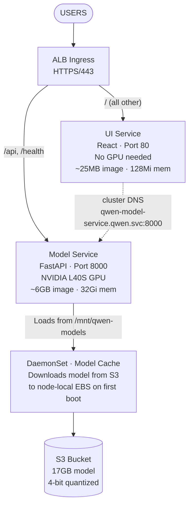
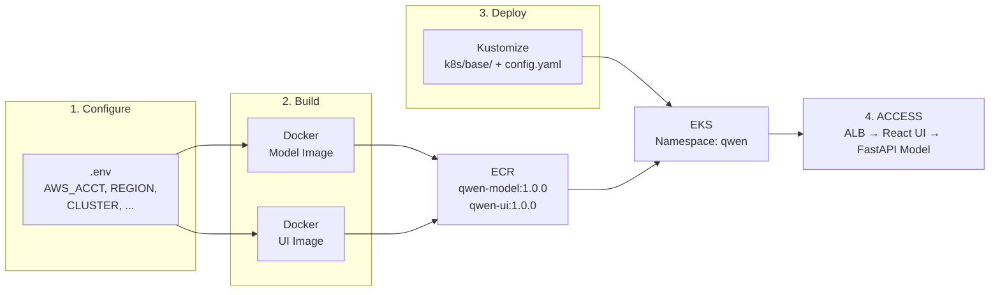
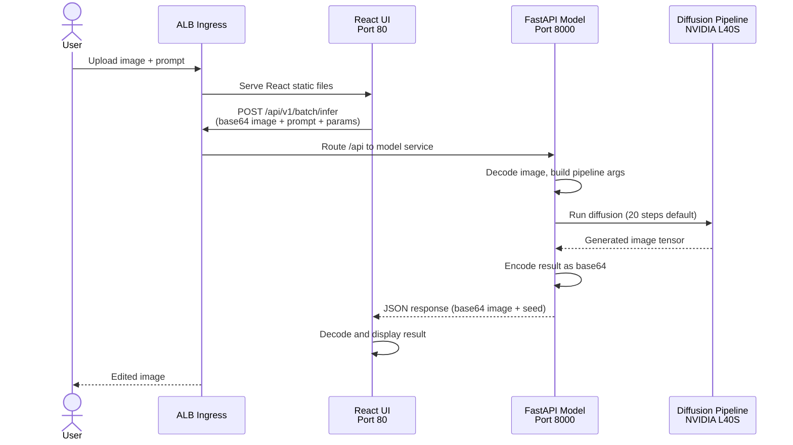
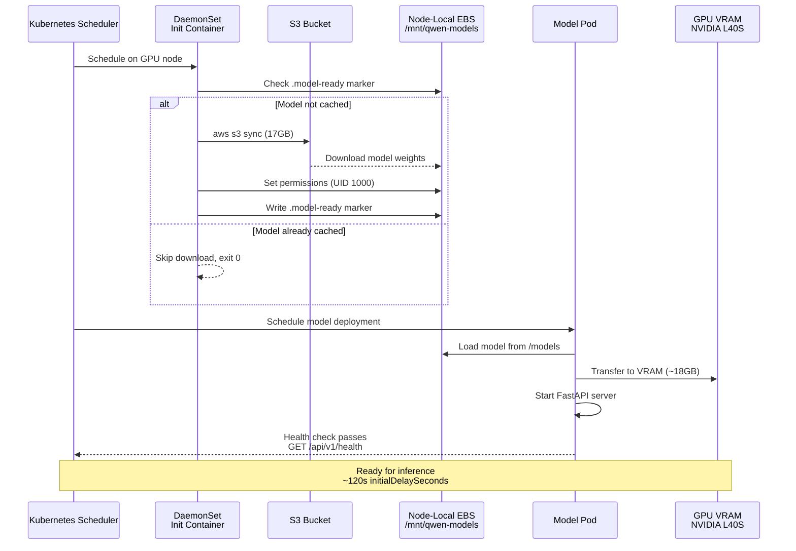

# Qwen Image Edit 2511 - EKS Deployment

AI-powered image editing using the Qwen Vision Language Model,
deployed on Amazon EKS with GPU acceleration.


## Architecture



### Two-Container Design

| Container           | Image Size | GPU                     | Purpose              |
| ------------------- | ---------- | ----------------------- | -------------------- |
| **Model** (FastAPI) | ~6GB       | NVIDIA L40S (48GB VRAM) | Inference engine     |
| **UI** (React)      | ~25MB      | None                    | Interactive frontend |

Separating UI from model allows fast UI iteration
without rebuilding the heavy model container.

## Deployment Flow



## Request Flow



## Model Loading Sequence



## Quick Start

### 1. Configure

Copy and configure the script's environment variables:

```bash
cp .env.example .env
```

Edit `.env` with your values:

```bash
AWS_ACCOUNT_ID=123456789012
AWS_REGION=us-east-1
EKS_CLUSTER_NAME=my-eks-cluster
EKS_NODEGROUP_NAME=gpu-nodes
K8S_NAMESPACE=qwen
ECR_REPO_UI=qwen-ui
ECR_REPO_MODEL=qwen-model
```

Also copy and configure the Kubernetes config's environment variables:

```bash
cp k8s/base/config.yaml.example k8s/base/config.yaml
```

### 2. Setup EKS Prerequisites

```bash
# Verify tools are installed (aws, kubectl, docker, helm)
./scripts/verify-prerequisites.sh

# Create ECR repositories
./scripts/create-ecr-repos.sh

# Setup IAM roles, EFS, S3 access
./scripts/setup-eks-prerequisites.sh

# Install ALB ingress controller
./scripts/install-alb-controller.sh
```

### 3. Build and Push

```bash
# Build and push both containers to ECR
./scripts/build-and-push-all.sh 1.0.0

# Or individually
./scripts/build-and-push-model.sh 1.0.0
./scripts/build-and-push-ui.sh 1.0.0
```

### 4. Deploy

```bash
./scripts/deploy.sh
```

### 5. Verify

```bash
# Watch pods come up
kubectl get pods -n qwen -w

# Check status
make status
```

## Makefile Commands

```bash
make help                          # Show all commands
make verify                        # Check prerequisites
make build-and-push-all VERSION=1.0.0 # Build + push both containers
make deploy                        # Deploy to EKS
make status                        # Deployment status
make logs                          # Tail all logs
make logs-model                    # Tail model logs
make logs-ui                       # Tail UI logs
make port-forward                  # Port-forward to model service
make batch                         # Run batch test
make clean                         # Remove local artifacts
```

## API

The model service exposes a FastAPI REST API on port 8000.

### Health Check

```bash
kubectl port-forward -n qwen svc/qwen-model-service 8000:8000
curl http://localhost:8000/api/v1/health | jq
```

```json
{
  "status": "healthy",
  "model_loaded": true,
  "gpu_available": true,
  "gpu_memory_used_gb": 18.2,
  "gpu_memory_total_gb": 48.0
}
```

### Batch Inference

```bash
curl -X POST http://localhost:8000/api/v1/batch/infer \
  -H "Content-Type: application/json" \
  -d '{
    "images": [{"data": "<base64-encoded-image>"}],
    "prompt": "Convert to Studio Ghibli style",
    "seed": 42,
    "guidance_scale": 3.0,
    "num_inference_steps": 20,
    "height": 1024,
    "width": 1024
  }'
```

| Endpoint              | Method | Description                  |
| --------------------- | ------ | ---------------------------- |
| `/api/v1/health`      | GET    | Health check with GPU status |
| `/api/v1/batch/infer` | POST   | Batch image inference        |
| `/api/docs`           | GET    | Swagger UI documentation     |

### Batch Testing Script

The batch script processes all images in `samples_images/`
against the FastAPI endpoint.

**Setup** (one-time):

```bash
python -m venv .venv
source .venv/bin/activate
pip install requests
```

**Usage**:

```bash
# Run with defaults
python scripts/batch_process_fastapi.py \
  --url https://your-domain.example.com

# Custom prompt
python scripts/batch_process_fastapi.py \
  --url https://your-domain.example.com \
  --prompt "Make it a watercolor painting"

# With options
python scripts/batch_process_fastapi.py \
  --url https://your-domain.example.com \
  --steps 30 --guidance-scale 5.0 --seed 123 \
  --output ./results

# Example from blog post
python scripts/batch_process_fastapi.py \
    --url https://your-domain.example.com \
    --prompt "Convert this image into clean black-and-white Japanese manga line art. Crisp inked outlines, no shading or color. Extend or generate additional background as needed to fill the 1:1 aspect-ratio canvas." \
    --steps 30 --guidance-scale 5.0 --seed 123 \
    --input ./samples_images/ --output ./output_images/
```

## Project Structure

```text
.
├── .env.example                  # Environment config template (cp to .env)
├── Dockerfile.model              # Model container (CUDA + FastAPI)
├── Dockerfile.ui-react           # UI container (React + nginx)
├── Makefile                      # Build/deploy/status commands
├── requirements-base.txt         # PyTorch, transformers, diffusers
├── requirements-app.txt          # FastAPI, Pydantic
├── src/
│   └── server.py                 # FastAPI model service (port 8000)
├── frontend/                     # React UI (TypeScript, Vite, Tailwind CSS)
├── k8s/
│   ├── base/
│   │   ├── config.yaml.example   # Kustomize config template
│   │   ├── kustomization.yaml    # Replacement rules
│   │   ├── namespace.yaml        # qwen namespace
│   │   ├── serviceaccount.yaml   # IAM role for S3 access
│   │   ├── deployment-model.yaml # Model pod (GPU, 32Gi)
│   │   ├── deployment-ui.yaml    # UI pod (no GPU, 512Mi)
│   │   ├── service-model.yaml    # ClusterIP :8000
│   │   ├── service-ui.yaml       # ClusterIP :80
│   │   ├── ingress.yaml          # ALB with path-based routing
│   │   └── daemonset-model-cache.yaml  # S3 model download per node
│   └── alb-controller/
│       └── iam-policy.json       # ALB controller IAM permissions
├── scripts/
│   ├── common.sh                 # Shared config (sources .env)
│   ├── build-and-push-all.sh     # Build + push both containers
│   ├── build-and-push-model.sh   # Build + push model container
│   ├── build-and-push-ui.sh      # Build + push UI container
│   ├── deploy.sh                 # kubectl apply -k k8s/base/
│   ├── setup-eks-prerequisites.sh # IAM, EFS, S3 setup
│   ├── install-alb-controller.sh # ALB ingress controller
│   ├── create-ecr-repos.sh       # Create ECR repositories
│   ├── verify-prerequisites.sh   # Check tools and access
│   ├── check-gpu-availability.sh # GPU instance capacity check
│   └── batch_process_fastapi.py  # Batch test against API
└── samples_images/               # 18 test images + prompts
```

## Performance

| Metric               | Value                  |
| -------------------- | ---------------------- |
| Model Size           | 17GB (4-bit quantized) |
| First Node Boot      | 4-5 min (S3 download)  |
| Pod Startup (cached) | 10-15 sec              |
| GPU Memory Usage     | ~18GB / 48GB (L40S)    |
| Inference Speed      | ~3 sec per step        |
| RAM Required         | 24GB                   |
| Storage per Node     | 20GB (model cache)     |

## AWS Requirements

- **EKS Cluster**: v1.28+
- **Node Group**: `g6e.xlarge` (NVIDIA L40S, 48GB VRAM), 100GB EBS
- **S3 Bucket**: 17GB for model weights
- **ECR**: Two repositories (~7GB total)
- **IAM Role**: S3 read access via IRSA
- **ACM Certificate**: For HTTPS (optional)

## Troubleshooting

**DaemonSet init container fails with "AccessDenied"**
Verify IAM role has S3 read permissions and IRSA is configured.

**ErrImagePull "no match for platform"**
Image built on Apple Silicon (ARM64) but EKS runs AMD64.
All build scripts include `--platform linux/amd64`.

**Model not found in cache**
Wait for DaemonSet to complete. Check:
`kubectl logs -n qwen -l app=qwen-model-cache -c download-model`

**Pod stuck in Pending**
No GPU nodes available. Check: `./scripts/check-gpu-availability.sh`

**503 errors or pod restarts during inference**
The model pod's liveness/readiness probes may time out during long inferences.
Higher step counts, multiple images, or larger resolutions can push inference
well beyond the default 120s probe timeout. Increase `timeoutSeconds` in
`k8s/base/deployment-model.yaml`:

```yaml
readinessProbe:
  timeoutSeconds: 300 # increase for longer inferences
livenessProbe:
  timeoutSeconds: 300 # must exceed your longest expected inference
```

Redeploy after changing: `kubectl apply -k k8s/base/`

**504 Gateway Timeout from ALB**
The ALB idle timeout (default 60s) may be shorter than your inference time.
The ingress is configured with `idle_timeout.timeout_seconds=300`. If you
need longer, update the value in `k8s/base/ingress.yaml`:

```yaml
alb.ingress.kubernetes.io/load-balancer-attributes: idle_timeout.timeout_seconds=600
```

Redeploy after changing: `kubectl apply -k k8s/base/`

## Resources

- [Qwen-Image-Edit-2511-4bit][qwen-4bit] (HuggingFace)
- [Qwen-Image-Edit-2511][qwen-orig] (Original model)
- [Amazon EKS User Guide][eks-docs]

[qwen-4bit]: https://huggingface.co/ovedrive/Qwen-Image-Edit-2511-4bit
[qwen-orig]: https://huggingface.co/Qwen/Qwen-Image-Edit-2511
[eks-docs]: https://docs.aws.amazon.com/eks/

## License

This project is licensed under the MIT License.
See the [LICENSE](LICENSE) file for details.

## Disclaimer

The contents of this repository represent my viewpoints and not
those of my past or current employers, including Amazon Web
Services (AWS). All third-party libraries, modules, plugins, and
SDKs are the property of their respective owners.
